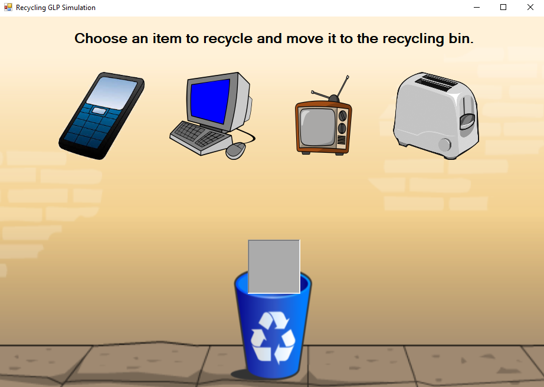

<h1 align="center">Electronic Waste Simulator</h1> 

<p align="center">
An interactive simulation of the electronic waste recycling process coded in C#. Completed as part of the computer science aspect of my sophomore year grade level project.
</p>

<p align="center">
A link to an online demo version can be found here: <a href="https://youtube.com/watch?v=FJiHjdOJCu4&t=5s" target="_blank">youtube.com/watch?v=FJiHjdOJCu4&t=5s</a>
</p>

## Picture Of A Form



## Setup

#### Clone
```bash
git clone https://github.com/aahmad4/Electronic-Waste-Simulation
```

#### Usage
One you open this file, click the green run button at the top.
```bash
sim.sln
```

## Contributing

Pull requests are welcome. For major changes, please open an issue first to discuss what you would like to change.

Please make sure to update tests as appropriate.


